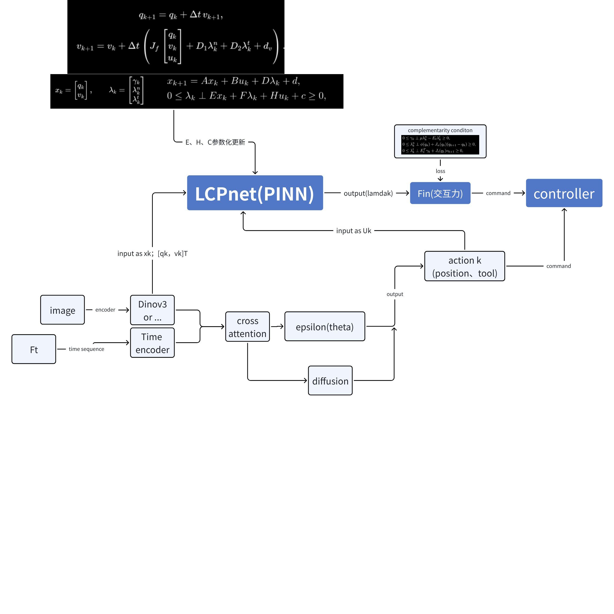

# PINN 项目进度汇报

更新日期：2026-06-01

## 1. 整体 Pipeline

项目整体目标是在 Diffusion Policy 的动作生成能力基础上，引入力觉、视觉和接触动力学约束，使机器人在接触任务中具备更稳定的力交互能力。

整体结构如下：



核心流程可以概括为：

```text
image
-> image encoder, such as DINOv3
-> image feature

FT time sequence
-> time encoder
-> force / torque feature

image feature + FT feature
-> cross attention
-> diffusion transformer policy
-> action sequence

action + robot proprioceptive state
-> PINN / LCPNet
-> future FT / contact force prediction

DP action + PINN predicted force
-> QP controller
-> robot command
```

这里形成一个快慢网络结构：

- **慢网络**：Diffusion Transformer Policy 根据图像、力觉和历史状态生成未来 action sequence。
- **快网络**：PINN / LCPNet 根据机器人当前本体状态和 action，预测未来接触力或 FT 变化。
- **控制层**：QP controller 同时接收 DP 生成的 action 和 PINN 预测的未来力，用于生成更符合接触约束的控制命令。

## 2. 模块划分

### 2.1 Diffusion Policy Baseline

Diffusion Policy 是当前项目的行为策略 baseline。它负责从视觉和低维状态中预测未来动作序列，用于建立基本任务执行能力。

该模块当前关注：

- 数据链路是否正确。
- 图像、低维状态和 action 是否对齐。
- action chunk 的预测与执行是否一致。
- 真机推理是否能稳定复现数据中的轨迹。

### 2.2 FT + Image Cross Attention

该模块用于将力/力矩序列和图像特征融合。图像提供接触对象的几何、表面和物理属性，FT 序列提供接触过程中的力学响应。

设计目标：

```text
image encoder -> visual feature
FT time encoder -> force feature
visual feature + force feature -> cross attention
cross attention feature -> diffusion transformer policy
```

该模块后续还可以为 PINN 提供接触相关隐变量，例如：

- 接触对象物理属性。
- 摩擦相关隐变量。
- 接触间隙 `phi_k`。
- 接触面几何或法向信息。

### 2.3 PINN / LCPNet

PINN 是项目的核心物理约束模块。它不是直接替代 Diffusion Policy，而是作为力学预测网络，与 DP 形成快慢网络配合。

PINN 输入：

```text
x_k = [q_k, v_k]
u_k = action_k, tau
```

其中：

- `q_k`：机器人关节位置或广义坐标。
- `v_k`：机器人关节速度。
- `u_k`：Diffusion Policy 输出的动作。
- `tau`：控制力矩

PINN 输出：

```text
 future FT
```

该输出用于约束控制器，使最终执行动作不仅接近 DP 预测，还满足接触动力学关系。

## 3. PINN 核心建模

PINN 当前采用 LCP / Stewart-Trinkle 接触动力学形式。

状态定义：

```text
x_k = [q_k, v_k]
lambda_k = [gamma_k, lambda_k^n, lambda_k^t]
```

状态更新形式：

```text
x_{k+1} = A x_k + B u_k + D lambda_k + d
```

互补约束形式：

```text
0 <= lambda_k ⟂ E x_k + F lambda_k + H u_k + c >= 0
```

其中：

- `lambda_k^n`：法向接触力或冲量。
- `lambda_k^t`：切向摩擦力或冲量。
- `gamma_k`：摩擦互补中的辅助变量。
- `E, F, H, c`：接触约束相关参数。
- `A, B, D, d`：状态更新相关参数。

PINN 的建模思路是用神经网络预测这些局部线性化矩阵或接触变量，再通过物理方程组装状态更新与约束损失。

当前计划中的 loss 包括：

```text
1. future FT prediction loss
2. friction cone loss
3. normal complementarity loss
4. tangential complementarity loss
5. next state prediction loss
```

这样可以让模型从“纯数据拟合”转向“数据拟合 + 接触物理约束”。

## 4. 数据处理 Pipeline

当前数据处理链路：

```text
原始 H5 数据
-> LeRobot v3
-> 补充低维派生量
-> 位姿格式统一
-> Rerun 可视化检查
-> 接触区间标注
-> 背景力解耦
-> PINN 训练数据
```

主要字段：

```text
q
v
a
ee_pose
ee_velocity
ee_acceleration
wrench / FT
image
action
contact_state
```

当前数据处理工具：

- `dataset/tool/h5_2_lerobotev3.py`
- `dataset/tool/lerobot_add_feature.py`
- `dataset/tool/ee_pose_matrix_to_quaternion.py`
- `dataset/tool/lerobotv3_rerun_visualizer.py`

## 5. 背景力解耦网络 wrench_bg

原始 FT 信号中同时包含背景力和接触力：

```text
raw_wrench = wrench_bg + lambda
```

因此在写摩擦锥和互补约束前，需要先估计背景力：

```text
lambda = raw_wrench - wrench_bg
```

`wrench_bg` 不作为最终控制网络的一部分，而是用于清洗接触任务数据，使 PINN 使用更接近真实接触力的监督信号。

### 5.1 wrench_bg v1：门控融合网络

文件：

```text
wrench_bg/wrench_background.py
```

输入：

```text
q / v / ee_pose
```

结构：

```text
q encoder
v encoder
ee_pose encoder
-> gate network
-> weighted fusion
-> wrench prediction
```

实验记录：

```text
val loss: 约 0.049
```

### 5.2 wrench_bg v2：静态/动态分支网络

文件：

```text
wrench_bg/wrench_background_v2.py
```

静态分支：

```text
f_static(q, ee_pose)
```

动态分支：

```text
f_dynamic(q, ee_pose, v, a, ee_velocity, ee_acceleration)
```

输出：

```text
wrench_bg = wrench_static + wrench_dynamic
```

实验记录：

```text
早期 val loss: 约 0.046
```

后续加入 `a / ee_velocity / ee_acceleration` 后，同分布训练 loss 明显下降，说明背景力中存在当前状态无法完全表达的动态项。

### 5.3 horizon 消融

背景力网络需要兼顾泛化和抗噪：

- `horizon=1`：最干净的单点 baseline，但容易受瞬时噪声影响。
- `horizon=3`：当前主推，能够利用短时间局部信息平滑差分噪声。
- `horizon=5`：后续可作为增强平滑对照。

已有训练结果：

| 实验 | 代表 checkpoint | val loss |
| --- | --- | ---: |
| h1 | `epoch_229_val_loss_0.002436.pt` | 0.002436 |
| h3 | `epoch_495_val_loss_0.000504.pt` | 0.000504 |
| h3_2 | `epoch_995_val_loss_0.000179.pt` | 0.000179 |

## 6. Diffusion Policy Debug 与 Baseline 实验

DP baseline 已完成数据链路、训练链路和真机推理链路的主要 debug。

主要问题包括：

- action chunk 的预测和执行逻辑需要对齐。
- gripper 输出是连续值，需要额外滤波或阈值逻辑。
- crop 过小会破坏图像与 action 的对应关系。
- batch size、归一化、freeze encoder 和 optimize step 会显著影响训练效果。

关键实验记录：

| 日期 | 配置 | 现象 |
| --- | --- | --- |
| 04.14 | ResNet + UNet, epoch500, horizon16, obs2, act8, crop76 | 真机直接去终点，不去抓取 |
| 04.18 | ResNet18 + UNet, epoch800, horizon16, obs2, act8, crop76 | action chunk 执行不正确 |
| 04.19 | ResNet18 + BC, epoch100, horizon16, obs2, act8, crop76 | 训练未完全收敛，但 policy 输出较合理 |
| 04.19 | ResNet + UNet, epoch1000, batch512 | 约 200 epoch 后过拟合，抓取时机改善但 Z 轴下不去 |
| 04.22 | batch128, gaussian normalizer, crop216 | 夹爪输出不稳定 |
| 04.24 | batch64, gaussian normalizer, crop216 | 几乎可以完成整个任务，可作为阶段 baseline |

### 成功推理视频

> TODO: 在此处加入成功推理视频。


## 7. 当前项目进度

### 已完成

- Diffusion Policy baseline 的数据、训练、推理链路 debug。
- H5 到 LeRobot v3 的数据转换链路。
- 低维派生量补充。
- `ee_pose` 统一为 quat7。
- Rerun 可视化和接触区间标注工具。
- LCP / Stewart-Trinkle 方程推导。
- PINN V2 的矩阵 head 原型。
- `wrench_bg` v1 门控网络。
- `wrench_bg` v2 静态/动态分支网络。
- `horizon=1 / 3` 的背景力预测消融实验。

### 进行中

- 使用 `wrench_bg` 解耦接触任务中的真实接触力。
- 验证 `lambda = raw_wrench - wrench_bg` 是否适合作为 PINN 约束输入。
- 将 PINN 输出的 future FT 与 DP action 一起接入 QP controller。

### 待完成

- FT + Image cross attention 的完整网络实现。
- image encoder 到 `phi_k` 或接触隐变量的建模。
- PINN 完整 loss，包括摩擦锥、法向互补、切向互补和状态更新。
- QP controller 接收 DP action 与 PINN predicted FT 的闭环验证。

## 8. 后续实验计划

1. 完成 `wrench_bg` 在接触任务非接触段上的验证。
2. 将清洗后的 `lambda` 写回数据集。
3. 训练 PINN V1：端到端 future FT prediction + friction cone loss。
4. 训练 PINN V2：矩阵 head + LCP 约束 + next state loss。
5. 实现 FT + Image cross attention 分支。
6. 将 DP action 与 PINN predicted FT 输入 QP controller，验证快慢网络控制效果。
