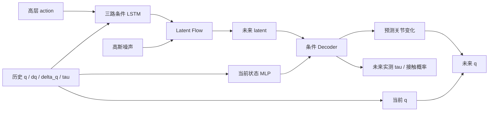

# Latent LSTM CARS-WM

## v2：条件 codec 与跨机械臂 SFT

新网络通过 `model.family: latent_carswm_lstm_v2` 启用。现有 v1 配置和
checkpoint 仍可加载；v1 的无条件 codec 不能直接作为 v2 的预训练权重，
需要使用下述 v2 配置重新预训练。两版使用同一个独立 trainer 和离线推理入口。

修改目标是让已知的当前状态直接参与物理量解码，为 latent 表达未来变化提供
结构上的便利，再检验 Nero 多任务预训练是否提高目标机械臂的数据效率。
状态旁路、冻结坐标和相同 latent 维数都不能证明 latent 已与机械臂动力学解耦。
目前迁移要求相同关节数量和输入排列，不支持异构关节数量或自动关节语义对齐。

### 网络分工



保留原有 motion/tau/action 三路两层 LSTM 和完整 Flow 积分。新训练配置使用
`model.temporal_position_encoding: contact_wm_learned_index`，与 `contact_wm`
相同：历史 token 保持从旧到新的排列，共享可学习的 recency 索引
`[L-1,...,0]`；action 与未来分别使用 `[0,...,K-1]`、`[0,...,H-1]` 的
可学习位置表。三个训练任务统一为 100 Hz 的 50 帧历史、32 帧未来，
25 Hz 的 8 个 native action。SFT 更新历史/action 位置表，冻结 Flow 使用
的未来位置表。旧 `relative_grid_sinusoidal` 配置仍可加载；两种位置编码
不混用 checkpoint。新索引编码不需要旧时间网格的量化及额外窗口筛选，
状态/action 的选择仍沿用 `contact_wm` 的原始时间戳和 native action 契约。
局部状态取历史最后一帧 `s_t=[q_t,dq_t,delta_q_t,tau_t]`；其中 `delta_q`
仍表示跟踪误差，`tau_t` 仍是实测关节力矩。

默认七关节、`latent_dim=128`、`local_state_dim=64` 时：

```text
P_decoder: s_t [B,28] -> Linear(28,128) -> SiLU -> Linear(128,64)
E: [q_future-q_t, tau_future, contact_one_hot, P_codec(s_t)]
   [B,H,81] -> Linear(81,128) -> SiLU -> Linear(128,128)
D: [raw_latent, P_decoder(s_t)] [B,H,192]
   -> 各自两层 MLP -> predicted_q_change(7), tau(7), contact_logits(3)
q_pred = q_t + predicted_q_change
```

关节相减和残差相加均发生在同一套 WM 归一化尺度中，输出再统一反归一化。
预测变化量以当前姿态为锚，不是相邻预测帧之间的增量。局部特征沿未来时间轴
和采样轴广播，`decode(raw_latent, batch)` 支持 `[B,H,D]` 和 `[B,S,H,D]`；
v2 必须传入观测历史。`sample()` / `predict()` 自动传入历史，不需要未来标签。

### 固定目标 latent 的坐标

codec 训练时，未来 Encoder 和 Decoder 共用可训练的 `local_state_encoder`。
codec 完成后，`snapshot_target_encoder()` 把它复制到冻结的
`target_state_encoder`，同时保存 `codec_normalizer`。以后 FM 目标始终使用
`future_encoder + target_state_encoder + codec_normalizer + latent_mean/std`。

SFT 可以更新 Decoder 使用的 `local_state_encoder`，但不能更新上述目标路径。
目标数据先从目标 WM 尺度还原为物理量，再转入预训练 codec 的尺度，然后
计算相对 q 和局部特征。Decoder 则继续读取目标 WM 尺度，学习目标机械臂的
输出接口。两个 normalizer 都保存在 checkpoint 中；目标统计量仍只由目标
训练 episode 拟合。SFT 支持 gaussian、limit 或未归一化的数据，拒绝有截断
信息损失的 quantile 输入。

### 三个训练阶段

| 阶段 | 更新的模块 | 固定的模块 | 损失 |
| --- | --- | --- | --- |
| codec | 未来 Encoder、局部状态 MLP、三个 Decoder | 条件 LSTM、Flow | q/tau 重建 MSE + 接触 CE |
| flow | 条件 LSTM、Flow、可选 free-tau 辅助头 | 整套 codec、目标状态快照、latent 统计量 | latent FM + 可选 free 辅助损失 |
| sft / frozen | 条件 LSTM、Decoder 局部状态 MLP、三个 Decoder、可选辅助头 | Flow、未来 Encoder、目标状态快照、latent 统计量 | 目标域 FM + 真实 latent 重建 |
| sft / adapter | 同上，加低秩速度适配器 | 同上，Flow 基础参数保持固定 | 同上 |

SFT 默认 `lambda_fm=1`、`lambda_reconstruction=1`。重建使用冻结 Encoder
产生的真实目标 latent，不把随机生成的多种未来都用 MSE 拉向同一条录制轨迹。
冻结 Flow 使用参数 `requires_grad=False`，仍保留计算图，让 FM 梯度经过
Flow 回传到条件 LSTM。`sft.train_motion_encoder` 默认 true；如果配置了 NEXT
运动编码器，SFT 可以更新它，输入仍经过嵌入的 NEXT normalizer 转换。设为
false 则冻结 motion LSTM，无论其初始化来自 NEXT 还是从头训练。

`sft.flow_mode: adapter` 使用零初始化的低秩速度残差：
`v = v_base + W_up W_down flow_features`。默认 rank=8，128 维隐藏特征和
128 维 latent 时仅增加 2048 个可训练参数。它不是逐层 LoRA；它保留基础
Flow 权重，在输出速度场上增加可训练修正。codec/flow 预训练阶段适配器冻结
且输出为零；SFT 初始速度场与预训练一致。

### 配置与运行

新增配置位于 `config/train_cfg/latent_wm/`：

- `nero_pretrain_all.yaml`：四个 Nero 数据源共用一个 codec 和 Flow；读取
  `data/nero_data/` 下四个新的 100 Hz WM LeRobot v3 数据集。
- `xarm_peel_cucumber_sft.yaml` / `xarm_erase_board_sft.yaml`：读取当前
  `data/xarm_co_v3/` 数据及已有离线力矩教师，默认冻结 Flow、训练目标接口。

新配置继承当前 xArm 的加载器滤波设置，Nero 使用同样的设置；原始源中已
施加的滤波仍由各自元数据描述。归一化转换不能消除滤波差异。迁移允许 action
坐标系及语义从 Nero 改为 xArm 的声明，保存原/目标契约供检查；相同维数不
表示不同坐标系或 action 语义已经对齐，这部分需要条件接口通过目标数据学习。

Nero 数据由 `scripts/prepare_nero_wm_data.py` 从 `../nero_ws/runs/` 的
`insert_usb`、`push_button`、`cuccumber_peeling`、`wipe_board` 原始 H5 转换。
100 Hz 状态保留原始帧和时间戳；25 Hz action 使用真实腕部相机时间戳，采样
该时刻已下发的命令，再保持到后续状态帧。保存每帧真实 `observation.q_cmd`，
`delta_q=q_cmd-q_follower`，与 held `action.joint` 分开。新导出不增加低通滤波，
WM 输入滤波由训练加载器执行。当前速度记录已经修正为关节坐标，不再翻转符号。

冻结力矩教师固定为
`outputs/tau_free_sequence/nero/epoch_124_val_tau_mse_nm2_0.005756.pt` 的 `model`
快照，使用其完整网络和归一化参数，不沿用 H5 中旧的残差字段。每个独立
episode/连续段取原始状态的偶数帧构成 50 Hz、25 帧的真实历史，教师预测
再对齐至原始 100 Hz 时间戳。`tau_ext=tau_measured-tau_free`。本次 Nero 标注
使用 L1 阈值 1 Nm；严格大于阈值为 contact，每段 contact 起点前
1 秒为 alignment，contact 优先，episode/断流/未知区间截断标注。

保存 `observation.tau_free`、`observation.tau_ext`、`observation.contact_phase`
和 `observation.tau_label_valid`。教师最初约 0.48 秒没有完整历史，phase=-1、
valid=0；不是 free。设置 `dataloader.tau_label_valid_key` 后，两种 WM 加载器
都会排除未知未来，未知历史也不能用于 free 辅助监督。新预训练配置已设置
该字段；预计算教师和标签契约纳入训练 checkpoint 的数据契约。

每个数据集的 `meta/wm_validation.json` 记录逐行验证结果，
`meta/torque_label_report.json` 记录教师 SHA256、标注规则及各轨迹类别数量。
转换先写入暂存目录，四个任务全部验证成功后再替换；原视觉 v3 目录移动到
独立备份目录。可从项目根目录重建：

```bash
.conda-env/bin/python -m scripts.prepare_nero_wm_data --replace
```

已有 `tau_ext` 的数据可以通过
`.conda-env/bin/python -m scripts.relabel_nero_contact --threshold 1` 重新标注。
该工具保留力矩教师输出和所有非标签列，更新接触标签、episode/global 统计、
数据契约，并备份之前的标签版本。xArm 保持教师标定的 11.705677733654019 Nm。

### 一次启动三个训练任务

入口是 `scripts/train_latent_wm_pretrain_sft.sh`。Nero 预训练是一个进程内部
顺序执行 codec 和 Flow，结束并核对最终 checkpoint 后，两项 xArm SFT
同时启动，各自加载同一个固定的预训练 EMA 快照。

| 任务/阶段 | 实际/有效 batch | 峰值学习率 | optimizer 更新步数 |
| --- | --- | --- | --- |
| Nero codec | 256 | 3e-4 | 20,000 |
| Nero Flow | 256 | 1e-4 | 250,000 |
| xArm 削黄瓜 SFT | 128 | 3e-5 | 50,000 |
| xArm 擦板 SFT | 128 | 3e-5 | 50,000 |

梯度累积为 1。共同设置：AdamW、weight decay 1e-4、梯度裁剪 1.0、BF16，
500 步 warmup 后 cosine 降到 1e-6。codec 的 `codec.lr` 独立于 Flow 的
`train.lr`，阶段切换会重建 optimizer/scheduler。验证按 episode 划分 5%，
seed=42；三阶段采样权重固定 `[1,5,5]`，对应 free/alignment/contact。
两项 SFT 的 FM 与真实 latent 重建系数均为 1，严格冻结 Flow、目标未来
Encoder、目标状态快照与 latent 统计量；不启用低秩适配实验。

```bash
# 只检查数据、生成实际配置及参数计划，不运行训练
bash scripts/train_latent_wm_pretrain_sft.sh --dry-run

# 一个 Nero 预训练进程完成后，两个 SFT 进程并行；默认都使用 cuda:0
bash scripts/train_latent_wm_pretrain_sft.sh

# 如需把两个 SFT 也按顺序执行
SFT_PARALLEL=0 bash scripts/train_latent_wm_pretrain_sft.sh

# 有多张 GPU 时，可以分别指定
PRETRAIN_DEVICE=cuda:0 PEEL_DEVICE=cuda:0 ERASE_DEVICE=cuda:1 \
  bash scripts/train_latent_wm_pretrain_sft.sh
```

默认根目录是 `outputs/latent_wm_v2/nero_pretrain_xarm_sft`；可通过
`LATENT_RUN_ROOT` 修改。目录包含实际 YAML 配置、`pipeline_plan.json`、
`nero_all/`、`xarm_peel_cucumber/`、`xarm_erase_board/`，每项任务各有
`train.log`、`status.json` 和 checkpoint。共享预训练权重在
`shared/pretrained_for_sft.pt`，其 SHA256 记录在同名 JSON 中。

脚本核对完成状态、optimizer 步数、codec 状态、位置编码、最终验证和
checkpoint 配置，确认预训练完成后才启动 SFT。已经完成的任务验证后跳过，
未完成的任务自动 `--resume`；同一个 run root 的参数变化会被拒绝，避免
混合实验。失败或中断会给其余训练子进程发送 TERM，让 trainer 保存恢复点。
`flock` 防止重复启动。默认单卡也启动两个 SFT 进程，实际吞吐应根据运行
日志判断；需要不同设备或较小 batch 时可调整脚本环境变量。

可用环境变量为 `PYTHON`、`LATENT_RUN_ROOT`、`PRETRAIN_DEVICE`、
`PEEL_DEVICE`、`ERASE_DEVICE`、`PRETRAIN_BATCH_SIZE`、`SFT_BATCH_SIZE`、
`CODEC_STEPS`、`PRETRAIN_STEPS`、`SFT_STEPS`、`SFT_PARALLEL`、`WANDB_MODE`。
步数缩小时 warmup 自动缩短；正常预算仍使用表中的 500 步。设置
`WANDB_MODE=offline` 或 `disabled` 可进行本地运行。

从项目根目录运行：

```bash
# 全部 Nero：条件 codec -> Flow
.conda-env/bin/python -m train.trainer.latent_contact_world_model_train \
  --config config/train_cfg/latent_wm/nero_pretrain_all.yaml

# xArm 目标任务：默认冻结 Flow
.conda-env/bin/python -m train.trainer.latent_contact_world_model_train \
  --config config/train_cfg/latent_wm/xarm_peel_cucumber_sft.yaml

# 同一预训练模型，允许低秩速度修正
.conda-env/bin/python -m train.trainer.latent_contact_world_model_train \
  --config config/train_cfg/latent_wm/xarm_peel_cucumber_sft.yaml \
  --flow-adaptation adapter \
  --output-dir outputs/latent_wm_v2/xarm_peel_cucumber_sft_adapter

# 同一目标数据和新网络，从头训练 codec + Flow 的对照
.conda-env/bin/python -m train.trainer.latent_contact_world_model_train \
  --config config/train_cfg/latent_wm/xarm_peel_cucumber_sft.yaml --stage all \
  --output-dir outputs/latent_wm_v2/xarm_peel_cucumber_scratch
```

`--pretrained-checkpoint /path/to/checkpoint.pt` 可替换预训练来源。SFT 初始化
只加载模型、codec 和统计量，重置 optimizer、EMA、目标训练步数；`--resume`
则严格恢复目标数据划分、归一化、SFT 模式/损失、optimizer、EMA、RNG 和
batch 游标，不再打开原预训练权重或原 NEXT 文件。新的输出目录为
`outputs/latent_wm_v2/`。预算是起始实验设置，不是收敛保证；比较时应报告
codec、预训练 Flow 和目标 SFT 各自训练预算。

### 迁移诊断

SFT 启动保存 `sft_initial_reconstruction.json`，先查看固定 Nero Encoder
在目标数据上的信息保留情况。训练记录同时包含 `latent_fm_loss`、
`sft_reconstruction_loss`、`sft_q_mse`、`sft_tau_mse` 及接触重建项。
源/目标模型契约和选用的 raw/EMA 快照记录在 `transfer.json`。

新配置设置 `probabilistic_validation.per_task_max_batches: 2`，按数据源
分别分配积分采样预算，覆盖所有有验证窗口的任务；这个设置覆盖全局
`max_batches`。FM 和 codec 重建仍遍历全部验证数据。验证同时输出
`task_<source_index>_*` 物理误差、接触分类及窗口数。现有 contact-phase
采样和 importance correction 保留；当前没有新增任务上下文 token 或按任务
等量采样，未观测到的环境差异仍可能体现为条件分布中的多种未来。

`latent_ablation: true` 额外固定观测历史和局部状态，分别把标准化 latent
置零（raw latent 替换为均值）及在 batch 窗口间循环打乱，再通过同一个
Decoder 解码。比较 `q_physical_rmse` / `tau_physical_rmse` 与
`latent_zero_*` / `latent_shuffled_*`，以及对应 contact CE；只有一个窗口
时跳过打乱项。性能没有明显变化时，应检查 Decoder 是否过度依赖状态旁路。
这些诊断覆盖积分采样的验证子集；需要自然分布上的完整验证时，设置
`per_task_max_batches: 0`、`max_batches: 0`。

测试覆盖条件 codec 梯度、残差尺度、冻结 Flow 后的梯度回传、目标 latent
稳定性、不同 normalizer 的坐标转换、低秩更新、无未来标签采样、跨 horizon
迁移、两种 SFT 模式的真实 CPU optimizer 更新及精确断点恢复。另有 CUDA
BF16 测试覆盖默认 128 维网络的 codec/Flow/SFT 前向、反向、冻结参数及
仅条件采样，无 CUDA 时跳过。它们验证实现行为，不能替代真实 Nero/xArm
训练和迁移效果的对照实验。

## v1：已有实现与兼容入口

Independent family/version `latent_carswm_lstm_v1`, branch
`feat/latent-carswm-lstm-grid`. The original WM model, trainer, configuration
files keep separate architecture and training stages. Both WM families now share
the single-threshold contact-label preparation described below. No registry is needed.

## xArm：训练启动时生成 tau_ext 和三阶段标签

Contact WM 与 Latent WM 均通过 `ContactWorldModelDataset` 在加载 episode 后、
归一化和训练集采样前调用 `data_process/wm_tau_labels.py`。不需要在 WM Parquet
预先保存 `observation.tau_ext`；启用后旧字段即使存在也不参与标注。

冻结的力矩教师权重位于
`outputs/xarm_tau_offline_20261004/deployment/model.pt`，包含已验证的辨识动力学、
摩擦系数、URDF、归一化统计和 BiLSTM 参数。它是用于离线标注的教师，配置在
`dataloader.tau_ext_generation.checkpoint`。Latent 的
`model.pretrained_taufree_path` 仍是单向运动编码器迁移接口，不能填入这个双向模型。
`outputs/` 不进入 Git；迁移到其他机器时需要一起复制该权重（本机已放好）。

标注使用 q/dq/delta_q 和实测 tau。数据先按时间戳对齐 100 Hz，再做四阶 5 Hz
零相位 Butterworth 滤波、降采样至 50 Hz。动力学先验加上残差网络输出得到
`tau_free`，插值回原时间戳后计算 `tau_ext=tau_matched_filter-tau_free`。
教师输入不含实测 tau；实测值只参与相减。

当前 WM 导出中 dq/tau 已有 20 Hz 因果低通。标注分支依据
`meta/world_model_timeline.json` 的可逆 one-pole cascade 元数据，在私有副本上还原，
再应用教师的训练预处理。原 WM 观测及 H5/Parquet 保持原样。未知滤波契约会报错。
教师按独立 episode/连续片段推理；片段首尾 1 秒、无效数据和跨断流上下文标为未知。

三阶段规则统一为：

- `sum(abs(tau_ext[J1:J7])) > 10 Nm`：contact，标签 2。
- 每段接触开始前 1 秒：alignment，标签 1；已有 contact 优先，前缀不跨 episode/断流。
- 其他有效位置：free，标签 0。等于阈值不算 contact。
- 上下文未知：标签 -1；包含未知未来标签的训练窗口排除，未知历史不能参加 free 辅助任务。

双阈值滞回和幅值过渡带的三阶段实现已删除。旧的 `thresholds`、`on_threshold`、
`off_threshold`、`consecutive_frames`、`phase_label_mode`、`precontact_frames` 配置会报错，
需改为 `contact_threshold` 和 `precontact_duration_s`。其他机器人预设迁移为单阈值时，
保留各自旧 on 阈值的数值；xArm 预设统一为 10 Nm。
曲线报告和接触信号检查工具也调用同一标注函数；新的 xArm 报告只输出 `phase`，
不再生成 `phase_band`/`phase_first` 两套标签。已有历史 HTML 不会自动重写。

```yaml
dataloader:
  tau_ext_generation:
    enabled: true
    checkpoint: outputs/xarm_tau_offline_20261004/deployment/model.pt
    cache_dir: outputs/cache/wm_tau_labels
    device: cpu
    threads: 2
    force_rebuild: false
contact_gate:
  enabled: true
  label_mode: three_phase
  metric: tau_ext_l1
  contact_threshold: 10.0
  precontact_duration_s: 1.0
  class_weights: [1.0, 1.0, 1.0]
train:
  contact_sampling:
    enabled: true
    phase_weights: [1.0, 5.0, 5.0]  # free / alignment / contact
    future_phase_reduction: max
    replacement: true
```

采样权重作用在预测窗口的最高阶段，表示每个窗口的相对抽样权重，不是固定阶段比例。
训练器保留现有 importance correction。free 辅助任务要求完整历史均有效且全部为 free，
用共享运动编码器的 q/dq/delta_q 特征回归当前实测 tau，目标在 WM 的归一化空间中。
Contact WM 使用 `loss.free_dynamics_weight: 0.1`；Latent WM 在 Flow 阶段使用
`loss.lambda_free: 0.1`，codec 阶段继续训练未来状态/接触重建。

已配置好的入口（从仓库根目录运行）：

```bash
python -m train.trainer.contact_world_model_train \
  --config config/train_cfg/pretrain/xarm/cwm_erase_board_100hz_40step.yaml
python -m train.trainer.latent_contact_world_model_train \
  --config config/train_cfg/latent_cwm_erase_board_100hz_40step.yaml

python -m train.trainer.contact_world_model_train \
  --config config/train_cfg/pretrain/xarm/cwm_peel_cucumber_100hz_40step.yaml
python -m train.trainer.latent_contact_world_model_train \
  --config config/train_cfg/latent_cwm_xarm_peel_cucumber_100hz_40step.yaml
```

擦板预设读取 `../xarm_ws/runs/cwm/erase_board_25hzcam_cwm_lerobot_v3`；
削黄瓜读取 `../xarm_ws/runs/cwm/peel_cucumber_cwm_lerobot_v3`。换数据修改 `train_data.sources`。
启动后会先显示 `prepare WM tau_ext labels`。推理缓存按输入数组、时间戳、滤波契约、
权重与代码哈希标识，两个模型共享缓存；改变接触阈值只重做阶段标注。
`tau_label_report.json` 保存缓存命中、逐 episode 阶段计数和标注契约。
恢复训练会校验标注契约；旧三阶段 WM checkpoint 的语义契约已变更，应重新训练。

短步训练验证：`python scripts/smoke_wm_tau_labels.py`，在 CPU 上取两个真实 episode，
每段最多 128 个窗口，Contact WM 训练 2 步，Latent WM 的 codec/Flow 各训练 2 步。
结果写入 `outputs/wm_tau_label_integration/smoke`，不覆盖正式训练目录。

## Entry points and budgets

From the repository root:

```bash
PYTHON=.conda-env/bin/python bash scripts/train_latent_cwm_two_tasks.sh
# One task, including recovery:
.conda-env/bin/python -m train.trainer.latent_contact_world_model_train \
  --config config/train_cfg/latent_cwm_insert_usb_100hz_40step.yaml \
  --resume outputs/latent_carswm_lstm_grid/insert_usb
```

The launcher locks the run, runs USB first, and verifies USB completion and
all five checkpoints before starting peel. Each task independently runs 10,000
codec optimizer updates followed by 250,000 Flow updates. Both task configurations
were derived from the actual workspace `config/train_cfg/pretrain/` files;
their source roots, feature mapping, filters, labels, splits, batch size,
optimizer/scheduler, AMP, device and EMA settings are retained. Seed is 42.
`train.stage` is `codec`, `flow`, or `all`; `--codec-checkpoint` skips Stage A
only after checking the codec, normalization, data and split contracts.

The separate `codec_step` and `global_step` count successful optimizer updates,
including when gradient accumulation is enabled. An FP16 scaler's skipped update
does not advance the counter, scheduler or EMA. Early stopping is rejected.
Flow checkpoints are `step_00050000.pt`, `step_00100000.pt`,
`step_00150000.pt`, `step_00200000.pt`, `step_00250000.pt`. BaseTrainer retains
the newest steps up to `top_k=5`. `latest.pt` also records complete recovery
state every 1,000 updates and on SIGINT/SIGTERM. Resume restores raw and EMA
states separately, optimizer, scheduler, scaler, RNG, stage and the actual
sample order/consumed cursor; worker prefetch does not advance that cursor.
SIGKILL/power failure falls back to the last atomic recovery file.

`resolved_config.yaml`, `grid_audit.json`, `metrics.jsonl`, `status.json`,
`codec.pt`, `codec_validation.json`, `final_validation.json` and checkpoint
visualizations provide durable records. `train.log` and `sequence.log` belong
to the sequential launcher. A `complete` status is written only after the
configured Flow update budget and final validation finish.

## Architecture and training

Exactly three unidirectional, `batch_first=True`, two-layer LSTMs condition
Flow. Motion receives concatenated `[q,dq,delta_q]` (21 channels), torque
receives measured `tau` (7), action receives the native action sequence (7).
Hidden/cell state resets on every window. Full motion/torque output sequences
form history memory; action remains a separate masked memory. Default width
is 128, history 50 at 100 Hz, future 40, action 10 at 25 Hz. The EE action is
absolute xyz + xyzw quaternion, in the original configured coordinate frame.

### Xarm erase-board data and missing EE actions

From the repository root, convert using
`python data_process/tool/h5_v3_wm.py -c config/shape_meta/swm/xarm/erase_board.yaml`.
This config keeps every native 100 Hz state row. With
`timeline.action_anchor_mode: state_frames` and `action_fps: 25`, action
snapshots come from state frame numbers **0, 4, 8, 12, ...**, and each is held
until the next selected frame. Frame numbers determine both selection and
holding; timestamp jitter does not change selected rows, and camera clocks
are not required. Recorded timestamps are preserved as timing metadata.
`action.joint` uses measured
`teleop/right_q_xarm`, as explicitly chosen for compatibility with that VA
dataset; `observation.delta_q` still uses commanded minus measured joints.
The single-channel external torque L1 signal remains `observation.tau_ext`.

The optional `action_fk` block materializes `action.ee_pose` when it is not
declared in the conversion features. It specifies the robot URDF, joint order,
base frame and target frame; paths resolve from the working directory. FK
uses raw radian joint actions before normalization and includes fixed tool
offsets. Poses are float32 `[x,y,z,qx,qy,qz,qw]`, in metres with unit
quaternions and `qw >= 0`. Non-finite numeric values fail conversion by
default. This xarm config selects `nonfinite_episode_policy: drop`, excluding
the entire invalid episode while keeping other episodes' clocks intact.
`meta/world_model_timeline.json` records excluded paths and reasons. No invalid
contact signal is replaced with zero. Existing declared EE actions take precedence.

Both WM datasets also accept `dataloader.action_fk` for older converted
datasets missing the configured EE action column. They compute and cache FK
from `action.joint` once at ingestion, preserve recorded action indices and
timestamps, and fit normalizers on the resulting EE conditions. Existing EE
columns are kept. Missing joints, incorrect dimensions, unknown frames or a
missing URDF produce an error. Do not substitute observation joints for a
joint-action column with different semantics.

Ready-to-run configurations are
`config/train_cfg/pretrain/xarm/cwm_erase_board_100hz_40step.yaml` for Contact WM
and `config/train_cfg/latent_cwm_erase_board_100hz_40step.yaml` for Latent WM.
Each uses history 50 at 100 Hz, action 10 at nominal 25 Hz and future 40
at 100 Hz. The current state is zero, the first future action is at `d0`,
and subsequent action tokens are at `d0 + 4*k`. Timestamps are not fed
directly to position encoding. Other configurations can retain the default
`recorded_camera` anchor mode, and fractional rate ratios remain supported
by the relative-step grid. In `state_frames` mode, fractional sampling uses
rounded cumulative frame offsets rather than rounding a single stride.

FutureEncoder is a separate deterministic, per-time MLP receiving normalized
q/tau and three-way contact one-hot. It uses two Linear layers and SiLU, mapping
17 to 128 to `latent_dim=128`. Each decoder uses exactly two Linear layers:
latent -> 128 -> q(7), tau(7), or contact logits(3). All heads decode the same
completed latent trajectory. This dimensionality is not a compression or
speed guarantee. There is no VAE, KL loss, autoregressive training, or required
generated delta_q.

Stage A trains only FutureEncoder and the heads with q/tau MSE and weighted
contact CE. Data normalization fits only training episodes. The chosen snapshot
is **final raw**, never a mixture with EMA. After freezing it, a fresh pass over
all training future windows fits per-channel latent mean/population std using
Welford merges. The std floor is 1e-4; near-zero channels are listed. Codec
weights, heads, statistics, snapshot SHA256 and validation metrics are saved
together in `codec.pt`. The 10k default budget is not a quality guarantee;
Stage B cannot recover information the codec discarded.

Stage B freezes the codec in eval mode. With no target-side gradient:

```text
z1 = (FutureEncoder(Y_future) - latent_mean) / latent_std
z0 ~ N(0,I), s ~ Uniform(0,1)
zs = (1-s) z0 + s z1
v_target = z1 - z0
loss = importance_weighted_MSE(v_theta(zs,s,conditions), v_target)
       + lambda_free * free_auxiliary_loss
```

The shared FlowTimeEmbedding and FlowDecoderBlock provide future self-attention,
parallel history/action cross-attention and FFN. Default depth/heads/multiplier
are 4/4/4, taken from the reference files. Training evaluates the velocity field
once; sampling integrates Gaussian noise across the complete [0,1] interval.
Default 16 Heun grid steps means 32 field evaluations; Euler uses 16.
`source_noise` has `[B,S,H,latent_dim]`, allowing fixed-noise comparison.
Conditions are encoded once and stay fixed throughout each integration.
Decoder input is the completed, denormalized latent. Outputs keep corresponding
sample axes `[B,S,H,D]` for q, tau and contact, rather than averaging modes.
`sample()` needs only conditions and grid positions, without future ground truth.

## NEXT motion pretraining

`model.pretrained_taufree_path: null` trains motion from scratch. A two-Linear
head on the last motion output regresses **current measured tau**, in the WM's
normalized tau space. Default `lambda_free=0.1`. Full-history validity and finite,
all-free contact labels determine the mask **before stride**. Padding, disabled
contact labels and any historical contact cannot confirm free. Select rows before
MSE, ignore non-free NaNs, normalize by selected importance weight sum, and
return differentiable zero for an empty/zero-weight set. Only motion and this
head receive this auxiliary gradient; neither tau nor action is read by the head.

For a non-null file/directory, the selected NEXT file is logged. The checkpoint
must specify LSTM, tau target, ordered `[q,dq,delta_q]`, explicit 7D inputs,
128 hidden units, two layers, stateless windows, matching history/cadence,
saved normalizer and compatible preprocessing. Only `recurrent.*` is imported,
with strict key/shape checks. The NEXT head (possibly width 256) is ignored.
The LSTM has no gradients, no optimizer membership, and stays eval after outer
`train()`. Other conditioners and Flow remain trainable. This mode has no random
free head and reports zero auxiliary contribution.

WM inputs are denormalized then normalized by NEXT statistics before the frozen
LSTM. Clipped quantile WM input is rejected because it cannot be inverted.
Filtering/resampling/source preprocessing differences are rejected; changing
normalizer statistics cannot repair them. In particular, the repository's raw
NEXT configuration with unfiltered motion is not automatically compatible with
the filtered WM sources. No unrelated robot/task checkpoint is selected.
Frozen weights, both sets of statistics and the validated contract are embedded
in new checkpoints. Loading/resume never opens the old NEXT or codec path.
Module parameter groups and `freeze_modules()` allow explicit future adaptation;
this run trains Flow normally and introduces no migration task.

## Relative robot-time grid and recorded data

One deterministic shared sinusoidal PE maps signed positions to hidden width.
There is no additional age, freshness, local-index or absolute timestamp feature.
Flow time s remains separate from robot physical time.

For external grid spacing Delta=10,000,000 ns and R=4:

```text
history = -L+1, ..., 0
future  = 1, ..., H
d0 = round((first_native_action_anchor_ns - request_history_anchor_ns)/Delta)
action  = d0, d0+R, ..., d0+(K-1)*R
```

Both timestamps are int64; subtract before division. Round nearest with ties
away from zero. Grid zero is the last measured observation in the **request**,
not inference completion. Explicit absolute grid metadata can instead supply
each history/action/future token's physical grid coordinate; subtract the
request grid anchor per token, including across scheduling windows.
The model receives only final int64 relative positions on its device.

In the V3 fallback the first action anchor is quantized once and other positions
use nominal R. Check every action period within ±4ms of 40ms and cumulative
drift within ±5ms over the chunk; native action indices must be consecutive.
State intervals must be within ±4ms of 10ms. Padding is exempt from state
cadence checks. Offset>0 rejects an actual first anchor preceding the observation.
Rounded d0=0 or 5 is legal and never clamped to 1..4. Ideal phase=0,1,2,3 gives
first positions 4,3,2,1. Concatenated sample_idx modulo four is never used.
State stride preserves external ticks: history retains current zero, and
future[::2] has positions 1,3,5,...; action stays native. Sampling a strided
model returns that sparse future grid, not invented intervening predictions.

Actual sources contain `timing.state_timestamp_ns`, `timing.action_index` and
`timing.action_anchor_timestamp_ns`. Unique action tables and native window
selection are inherited episode-locally. Median cadence alone is insufficient:
preflight found USB 906 and peel 331 periods outside ±10%, with maximum periods
51.151ms and 52.050ms. The new task configs explicitly select
`grid_invalid_window_policy: drop`; the adapter audits before splitting/fitting
and reports all rejected windows per episode. USB retains 182,078 of 213,796
windows; peel retains 68,847 of 80,808. No timestamps, actions or labels are
modified. Use policy `error` to abort rather than exclude incompatible windows.
Clock drift checks make the rejected-window fraction larger than the fraction
of individual exceptional action periods; results apply to the retained windows.

## Nero integration and offline example

Existing Nero WMAdapter is **not** claimed to load this family. Nero needs a
new family dispatch and `load_latent_checkpoint()` entry, plus the shared grid
helper and normalization contract. Example:

```bash
.conda-env/bin/python -m scripts.latent_cwm_nero_offline \
  --checkpoint outputs/latent_carswm_lstm_grid/insert_usb/checkpoints/latest.pt \
  --condition /path/to/measured_condition.pt --output /tmp/future_samples.pt \
  --device cuda:0 --num-samples 8 --seed 1234
```

The condition file contains physical, already compatibly preprocessed batched
`q,dq,delta_q,tau [B,L,7]`, absolute EE `action [B,K,7]`, optional action mask,
int64 `history_timestamp_ns [B,L]`, `action_chunk_timestamp_ns [B,K]`, and
optional `action_chunk_index [B,K]`. Padding can supply `history_real_mask`.
Alternatively `explicit_grid` contains `anchor_grid_position [B]` and absolute
per-token history/action/future grid positions. The example needs no true future
states and returns physical q/tau plus contact probabilities with matching S axes.

Choose the action window by the **currently held recorded native action index**
plus `action_start_offset=1`, then K consecutive native action tokens. Honor
configured prefetch delay selection on native anchors before constructing PE.
The old global-next-slot window can differ from native-next-action when source
clocks, phase, or recording jitter differ. Adding PE while retaining a different
window selection does not reproduce this trained contract. A multi-plan chunk
needs each token's own grid anchor; do not apply the first plan's origin to all.

Keep the original request anchor and prefetch latency indices so an executor
selects the appropriate prefix of the predicted future after computation.
Do not reset the origin to inference completion. Distinguish the 100 Hz state
interface from actual full sampling update frequency and the executed prefix
length. New observations trigger new sampling calls; each call uses fixed
conditions through its complete integration. `evaluate_feedback()` accepts a
series of recorded measured windows with re-anchored actions. It never writes
predicted tau into measured history. Pure free-running autoregression is not
implemented: future q_cmd/delta_q is unavailable when generating only q/tau.

## Validation scope

Codec reconstruction and physical q/tau MAE/RMSE, contact CE and per-class
precision/recall/F1 are separate from Flow latent FM/auxiliary losses. Integrated
validation uses the model's 16 steps/solver and fixed source seed. Sampled
physical errors average individual sample errors, not a mean trajectory.
Distribution metrics/energy scores use normalized streams for scale balance.
Codec metrics and latent FM cover the full validation split; integrated
distribution/physical/contact metrics cover `probabilistic_validation.max_batches`
(8 in the task configs), or all batches when zero. Monitor replacement honors
the preserved energy-score configuration. Contact confusion matrices accumulate
over all evaluated windows before F1. Different seeds can produce different
completed futures; fixed seeds/noise reproduce comparisons.

Targeted tests use synthetic NEXT files and synthetic episode columns. They
verify three LSTMs, gradient isolation, numerical transfer with differing scales,
strict incompatibility failures, self-contained loading, phases/rounding,
episode boundaries, full Heun interval and shared decoder samples, codec reuse,
and reduced-budget real optimizer runs/resume/top_k. These are CPU interface and
training smoke tests, not evidence of 250k training or real robot performance.
GPU/NPU kernels, hardware feedback latency and Nero deployment require their
own measurement. Consult the durable run status and final metrics for real
training progress; absence of a final metric/checkpoint means it has not completed.
